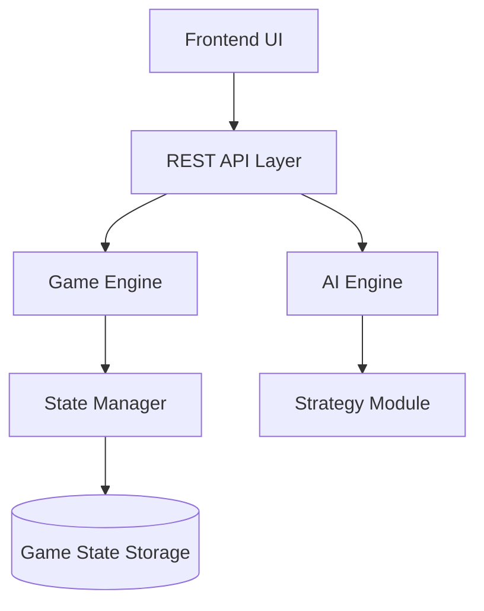

# Design Document

## Overview

Infinity Grid Duel is implemented as a web-based application with a RESTful API backend and a frontend interface. The architecture separates game logic, state management, AI strategy, and presentation concerns. The system uses a stateless API design with persistent game state storage.

## Architecture

### High-Level Architecture



### Technology Stack

- **Backend**: Node.js with Express.js for REST API
- **Frontend**: React for UI components
- **Storage**: In-memory storage with JSON serialization (can be extended to database)
- **AI**: Rule-based strategy engine with configurable priorities

## Components and Interfaces

### 1. Game Engine

The Game Engine is the core component responsible for game logic, move validation, and state transitions.

**Responsibilities:**
- Initialize new games
- Validate move legality
- Execute moves and captures
- Detect win conditions
- Manage turn transitions

**Key Methods:**
```typescript
interface GameEngine {
  initializeGame(mode: GameMode): GameState
  validateMove(state: GameState, player: Player, row: number, col: number): boolean
  executeMove(state: GameState, player: Player, row: number, col: number): GameState
  detectWinner(state: GameState): Player | 'draw' | null
  getAdjacentCells(row: number, col: number): Position[]
  captureTiles(board: Board, player: Player, row: number, col: number): Board
}
```

### 2. State Manager

The State Manager handles persistence and retrieval of game states.

**Responsibilities:**
- Store game states with unique identifiers
- Retrieve game states by ID
- Update existing game states
- Maintain move history

**Key Methods:**
```typescript
interface StateManager {
  createGame(initialState: GameState): string
  getGame(id: string): GameState | null
  updateGame(id: string, state: GameState): void
  deleteGame(id: string): void
}
```

### 3. AI Engine

The AI Engine calculates optimal moves for the AI player using rule-based strategy.

**Responsibilities:**
- Identify all legal moves for AI
- Evaluate moves based on strategic priorities
- Select the best move according to strategy rules
- Execute prompt-driven decision making

**Key Methods:**
```typescript
interface AIEngine {
  calculateMove(state: GameState): Position
  evaluateMoves(state: GameState, legalMoves: Position[]): ScoredMove[]
  prioritizeCaptures(moves: ScoredMove[]): ScoredMove[]
  prioritizeBlocking(moves: ScoredMove[]): ScoredMove[]
  prioritizeExpansion(moves: ScoredMove[]): ScoredMove[]
}
```

**Strategy Priority:**
1. Capturing opponent tiles (highest priority)
2. Blocking opponent expansion opportunities
3. Expanding AI territory (lowest priority)

### 4. REST API Layer

The API Layer exposes game functionality through HTTP endpoints.

**Endpoints:**

```
POST /game/start
Body: { mode: 'PvP' | 'PvAI' }
Response: GameState

GET /game/state/:id
Response: GameState

POST /game/move
Body: { gameId: string, player: string, row: number, col: number }
Response: GameState

POST /ai/move
Body: { gameId: string }
Response: { row: number, col: number }
```

### 5. Frontend Components

**Menu Component:**
- Game mode selection (PvP / PvAI)
- Navigation to game board

**Board Grid Component:**
- 6x6 grid visualization
- Cell click handlers for move placement
- Visual distinction for empty, Red, and Green cells

**Turn Indicator Component:**
- Display current player
- Show game status (in progress, winner, draw)

**Move List Component:**
- Chronological display of all moves
- Player color, row, and column for each move

**Restart Button Component:**
- Trigger game restart
- Reset board and state

## Data Models

### GameState

```typescript
interface GameState {
  id: string
  board: Board              // 6x6 array: 0 | 'R' | 'G'
  currentPlayer: Player     // 'R' | 'G'
  mode: GameMode            // 'PvP' | 'PvAI'
  winner: Player | 'draw' | null
  moveHistory: Move[]
}
```

### Board

```typescript
type Cell = 0 | 'R' | 'G'
type Board = Cell[][]  // 6x6 grid
```

### Player

```typescript
interface Player {
  id: string
  name: string
  color: 'R' | 'G'
  isAI: boolean
}
```

### Move

```typescript
interface Move {
  player: 'R' | 'G'
  row: number
  col: number
  timestamp: number
  capturedCount: number
}
```

### Position

```typescript
interface Position {
  row: number
  col: number
}
```

### ScoredMove

```typescript
interface ScoredMove {
  position: Position
  score: number
  captureCount: number
  blockCount: number
}
```

## Game Logic Details

### Move Validation Rules

1. **First Two Moves**: Red's first move and Green's first move can be placed anywhere on the empty board
2. **Subsequent Moves**: Must be placed on an empty cell adjacent to at least one of the player's existing tiles
3. **Adjacency**: Only horizontal and vertical adjacency counts (not diagonal)

### Capture Mechanics

When a player places a tile:
1. Identify all adjacent cells (up, down, left, right)
2. For each adjacent cell containing an opponent tile, convert it to the current player's color
3. Update the board state with all captures applied simultaneously

### Win Detection

1. Check if all 36 cells are filled
2. Count tiles for each player
3. Determine winner based on majority, or draw if equal

### AI Strategy Implementation

The AI evaluates each legal move and assigns scores based on:

**Capture Score**: +10 points per opponent tile that would be captured
**Block Score**: +5 points if the move prevents opponent from capturing on their next turn
**Expansion Score**: +1 point for expanding into new territory

The AI selects the move with the highest total score. Ties are broken randomly.

## Error Handling

### API Error Responses

```typescript
interface ErrorResponse {
  error: string
  message: string
  statusCode: number
}
```

**Error Scenarios:**

1. **Invalid Move (400)**
   - Cell is not empty
   - Cell is not adjacent to player's tiles
   - Not the player's turn

2. **Game Not Found (404)**
   - Invalid game ID provided

3. **Game Already Ended (409)**
   - Attempting to move after winner is determined

4. **Invalid Request (400)**
   - Missing required fields
   - Invalid player color
   - Invalid coordinates (out of bounds)

### Frontend Error Handling

- Display error messages to user for invalid moves
- Prevent UI interaction when game has ended
- Show loading states during AI move calculation
- Handle network errors gracefully with retry options

## Testing Strategy

### Unit Tests

**Game Engine Tests:**
- Move validation logic for all edge cases
- Capture mechanics with various board configurations
- Win detection with different scenarios
- Adjacent cell calculation

**AI Engine Tests:**
- Legal move identification
- Move scoring and prioritization
- Strategy rule application
- Edge cases (no legal moves, single option)

**State Manager Tests:**
- Game creation and ID generation
- State retrieval and updates
- Move history tracking

### Integration Tests

**API Endpoint Tests:**
- Game initialization flow
- Complete game playthrough (PvP)
- Complete game playthrough (PvAI)
- Error handling for invalid requests

**Frontend Integration Tests:**
- User interaction flows
- Move placement and board updates
- AI move triggering and response
- Game restart functionality

### End-to-End Tests

- Complete PvP game from start to finish
- Complete PvAI game with AI making strategic moves
- Game restart and state reset
- Move history accuracy throughout game

## Performance Considerations

- **Board State**: 6x6 grid is small enough for in-memory operations
- **AI Calculation**: Rule-based strategy executes in O(n) time where n is number of empty cells (max 36)
- **State Storage**: Use efficient JSON serialization for persistence
- **Frontend Rendering**: React component optimization for board updates

## Security Considerations

- Validate all move coordinates are within bounds (0-5)
- Verify player color matches current player before executing move
- Sanitize all user inputs
- Implement rate limiting on API endpoints to prevent abuse

## Future Enhancements

- Persistent database storage (PostgreSQL, MongoDB)
- User authentication and player profiles
- Game replay functionality
- Advanced AI with minimax algorithm
- Multiplayer matchmaking
- Game statistics and leaderboards
- Configurable board sizes
- Undo/redo functionality
